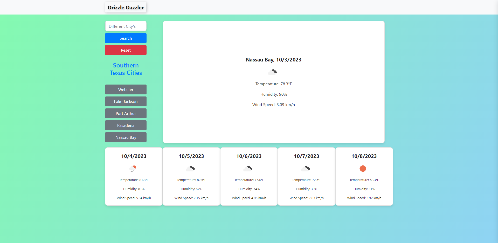

# Drizzle Dazzler

Weather generator for city's near the houston area.

## Description

Drizzle Dazzler is a web application designed to generate weather information for cities in the vicinity of Houston. By selecting a city from the provided list and clicking a button, users can obtain unique and detailed weather information for their desired location. The application aims to provide a fun and interactive way to explore weather conditions in the region.

# Features

- Select from a list of cities near Houston
- Generate unique weather information with a single click
- View detailed weather information, including temperature, humidity, and wind speed
- Responsive design for easy use on various devices

## Screenshot

## Dependencies

- OpenWeatherMap API

## Resources

- https://stackoverflow.com
- https://w3collective.com
- https://google.com
- https://OpenAI.com

## License 🔐

- [MIT License](LICENSE.md)

## Contact ☎️

- [Deazymat](https://github.com/Deazymat/Project-1)

---